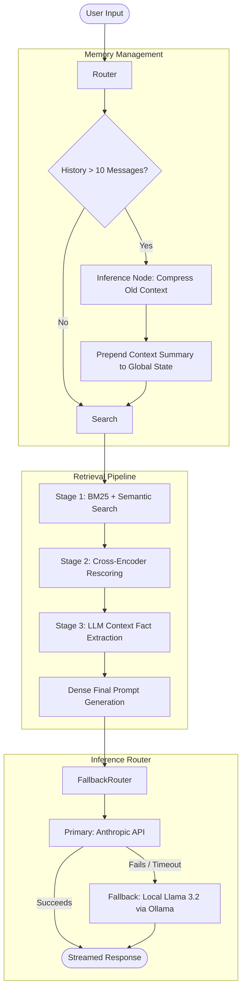

# Advanced Retrieval-Augmented Generation (RAG) Architecture

## Overview
This repository contains a production-ready, CLI-based Retrieval-Augmented Generation (RAG) engine designed with a focus on fault tolerance, context optimization, and high-precision retrieval. The system is built using a highly modular, decoupled architecture that adheres to Separation of Concerns (SoC) principles, allowing independent scaling of the retrieval, memory management, and inference components.

## Core Architecture

The system pipeline relies on a Multi-Model router, a two-stage hybrid retrieval system, and asynchronous background context management.


## Technical Components

### 1. Multi-Stage Retrieval Pipeline
To mitigate the inherent precision issues of standard cosine-similarity vector searches, the retrieval engine implements a phased filtering approach:

* **Stage 1 (Hybrid Search):** Utilizes `ChromaDB` and `sentence-transformers/all-MiniLM-L6-v2` for dense vector embeddings, algorithmically fused with **BM25** for sparse keyword matching. This eliminates vocabulary mismatch blind spots.
* **Stage 2 (Cross-Encoder Reranking):** Initial candidate chunks are paired with the query and passed through a `cross-encoder/ms-marco-MiniLM-L-6-v2` model. This calculates absolute relevance scores via cross-attention, rescoring the candidates to ensure strict precision.

---

### 2. Context Optimization & Compression
To prevent token bloat and bypass the **"Lost in the Middle"** syndrome typically seen in heavy RAG implementations:

* **Fact Extraction Pipeline:** Prior to finalizing the prompt, the system silences standard output and routes the deeply rescored documents through an LLM layer designed strictly to extract answering facts, dropping irrelevant peripheral text.
* **Smart Memory Management:** Instead of utilizing a static sliding window that arbitrarily truncates context upon reaching capacity, the system triggers an internal summarization event. Older token histories are compressed into dense system-prompt instructions, ensuring long-term conversation persistence without OOM errors.

---

### 3. Fault-Tolerant Inference Router
Calculations and primary generations are routed using the **Strategy Design Pattern**.

* **Fallback Chain:** Inference requests are abstracted through an `LLMRouter` class executing a predefined fallback list. If the primary cloud API (**Anthropic**) fails due to latency, network loss, or rate limits, the `Exception` is caught silently and the payload is automatically diverted to a localized edge model (**Llama 3.2 via Ollama**).

---

### 4. Continuous Evaluation Framework
Abstracted outside of the core `src/` directory resides `eval_harness.py`, an offline **LLM-as-a-Judge** script.

* By structuring static mathematical evaluations targeting **Context Precision** and **Answer Faithfulness**, the system natively supports CI/CD pipeline gating, removing the requirement for heavy integration with external telemetry tools like RAGAS or TruLens during the testing phase.

---

---

## ⚙️ Installation and Configuration

### 📋 Prerequisites
* **Python 3.10+**
* **Ollama:** A running instance is required if the fallback router is executed (specifically for `Llama 3.2`).

###  Environment Setup
---

##  Installation and Configuration

###  Prerequisites
* **Python 3.10+**
* **Ollama:** A running instance is required if the fallback router is executed (specifically for `Llama 3.2`).

### 🛠️ Environment Setup
1. **Clone the repository** and navigate to the project directory.
2. **Install dependencies:**
   ```bash
   pip install -r requirements.txt
   ```
3. **Configure Environment Variables:** Create a .env file at the root level and add your credentials
   ```bash
   ANTHROPIC_API_KEY=your_production_key_here
   ```
###  Execution
1. **Main Application**
Initialize the engine via the CLI to start the chatbot:
```Bash
python src/main.py
```
2. **Automated Testing**
The repository contains a fully structured pytest suite utilizing unittest.mock.MagicMock to simulate multi-node API failures and validate retrieval math without incurring token costs.

Execute the test suite:
```Bash
pytest -v
```
3. **Continuous Evaluation**
Run the offline evaluation metric script to check Context Precision and Faithfulness:
```Bash
python eval_harness.py
```
   

   
